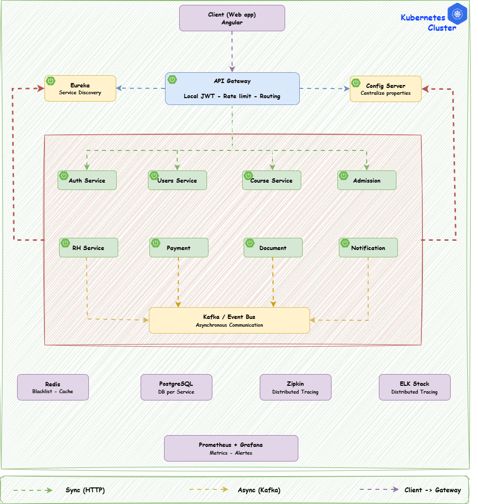

# 🎓 AdmissionSchool
AdmissionSchool is a microservices-based study management system inspired by the admission process of Université Laval.

The goal of this project is to design and implement a scalable, resilient, and cloud-ready architecture for managing student admissions, applications, and academic records.

This project focuses not only on coding but also on software architecture design, DevOps practices, and distributed systems principles.

## 🏗️ System Architecture

# 📌 Project Objectives

The main objectives of this project are:
- Design a modern microservices architecture
- Define functional and non-functional requirements
- Implement independent domain services
- Apply DevOps and cloud-native practices
- Demonstrate software architecture skills